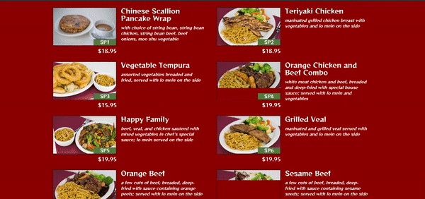

# David-Chu-s-China-Bistro
A responsive website created for the restaurant using bootstrap, css, html, javascript and ajax codes.

# Disclaimer
This website is not prepared for official use.

# Description
Here's a dummy website created for the restaurant named above. You can go to the site and look for the food you want to eat in the Menu tile and you can also navigate to the Special tile to get special dishes provided by the restaurant. You can call the restaurant by using the phone number. You can also navigate to the map to get the exact location of the Restaurant.  

# Demonstration

Here's the demonstration how this web-application is used in effective manner:

1)Opening website

2)Checkout menu and specials

3)Navigate through Map

